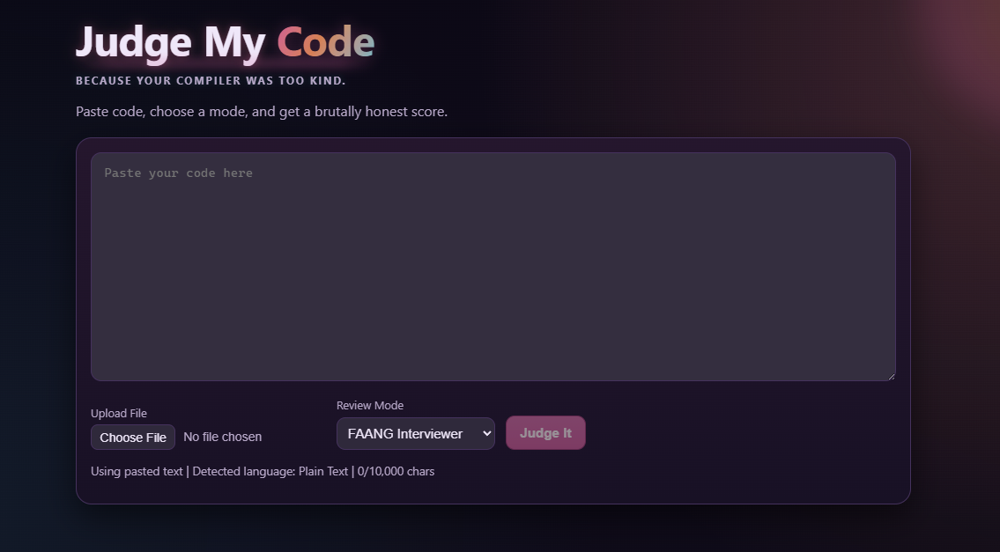

# Judge My Code

Paste code, pick a review mode, and get a brutally honest breakdown with practical fixes.

[](https://nextjs.org/)
[](https://www.typescriptlang.org/)
[](https://judge-my-code.vercel.app/)
[](https://upstash.com/)



[Live App](https://judge-my-code.vercel.app/)

## Highlights

- Three review personas: FAANG Interviewer, Senior Developer, Toxic Reviewer.
- Smart language detection from file extension and syntax heuristics.
- Structured scorecards for quality, readability, efficiency, and maintainability.
- Shareable permalink pages at `/r/[id]`.
- Server-side schema validation and moderation pass.
- Durable rate limiting and permalink storage with Upstash Redis.

## Tech Stack

- Next.js App Router
- TypeScript
- Zod validation
- Gemini API
- Upstash Redis

## Quick Start

1. Install dependencies.

```bash
npm install
```

2. Create `.env.local`.

```bash
GEMINI_API_KEY=your_api_key
GEMINI_MODEL=gemini-3.1-flash-lite-preview
UPSTASH_REDIS_REST_URL=your_upstash_rest_url
UPSTASH_REDIS_REST_TOKEN=your_upstash_rest_token
```

3. Run the development server.

```bash
npm run dev
```

4. Open `http://localhost:3000`.

Without `UPSTASH_*` variables, rate limiting and permalink storage fall back to local in-memory behavior.

## Deployment

- Production: https://judge-my-code.vercel.app/
- Platform: Vercel

## Environment Variables

| Variable | Required | Purpose |
| --- | --- | --- |
| `GEMINI_API_KEY` | Yes | Authenticates Gemini API calls. |
| `GEMINI_MODEL` | Optional | Overrides default model (default in code is `gemini-3.1-flash-lite-preview`). |
| `UPSTASH_REDIS_REST_URL` | Recommended | Durable rate limiting and permalink storage. |
| `UPSTASH_REDIS_REST_TOKEN` | Recommended | Auth token for Upstash Redis REST API. |

## API Limits

- Max code length: `10,000` characters.
- Max request body size: `100,000` bytes.
- Rate limit: `12` requests per `10` minutes per client key.
- On limit hit, API returns `429` with `Retry-After` and `X-RateLimit-*` headers.

## Notes

- Gemini calls run on the server so API keys stay out of the client.
- Review request size is capped and code input is limited to 10,000 characters.
- API rate limiting is enabled (Upstash durable in production, local fallback for dev).
- Share links are stored in Upstash Redis when configured.
